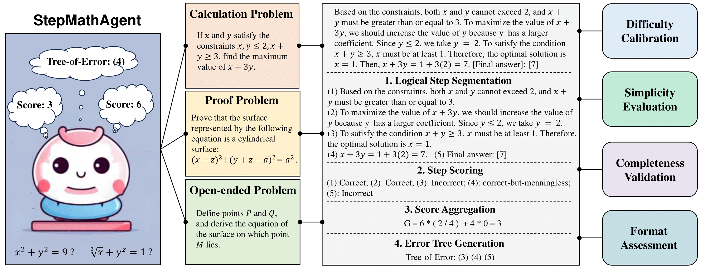
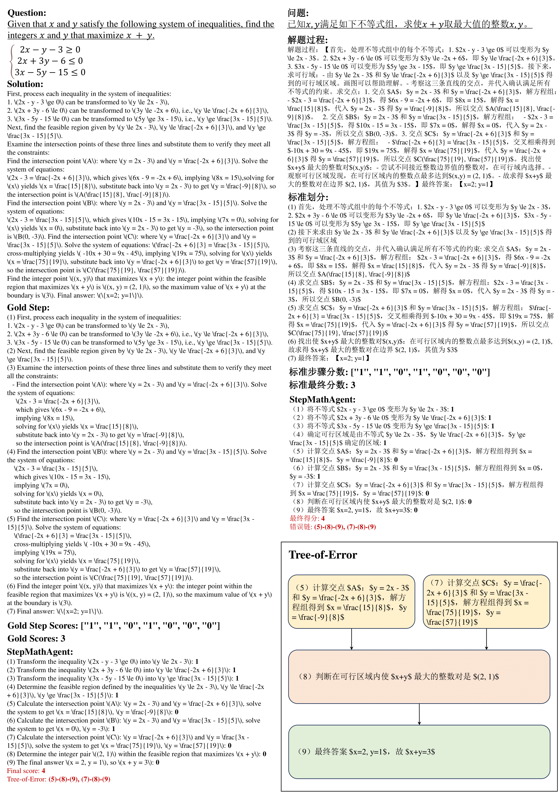

# StepMathAgent

**StepMathAgent** is a novel mathematical process evaluation agent based on Tree-of-Error, which incorporates four internal core operations: logical step segmentation, step scoring, score aggregation and error tree generation, along with four external extension modules: difficulty calibration, simplicity evaluation, completeness validation and format assessment.



We also introduce **StepMathBench**, a benchmark comprising 1,000 step-divided process evaluation instances, derived from 200 high-quality math problems grouped by problem type, subject category and difficulty level.

## StepMathBench

Mathematical Problem: `data/question.jsonl`

StepMath: `data/stepmath.jsonl`

## Quick Start

### Use StepMathAgent

```python
python agent.py
```

### Use Four External Extension Modules in StepMathAgent

```python
# Modify model_name in agent.py
python agent.py
```

### Run Baseline

```python
# Modify api_name and model_name in agent.py
python agent.py
```

### Evaluation

```python
python evaluator.py
```

## Case Study



## Citation

If you find this work useful in your research, please consider citing:

```

```